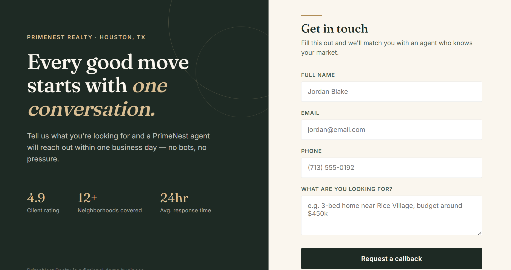
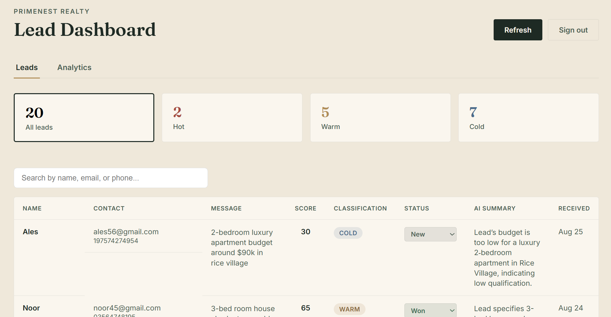
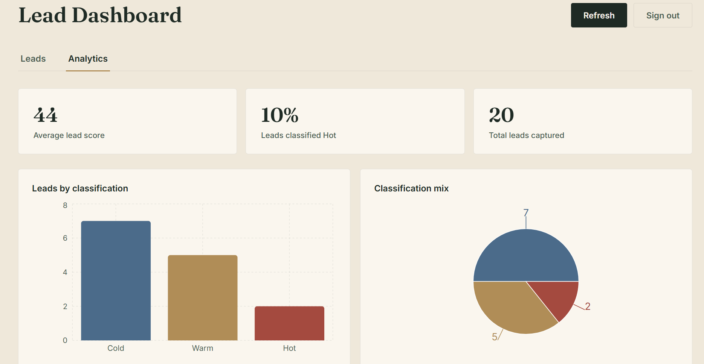
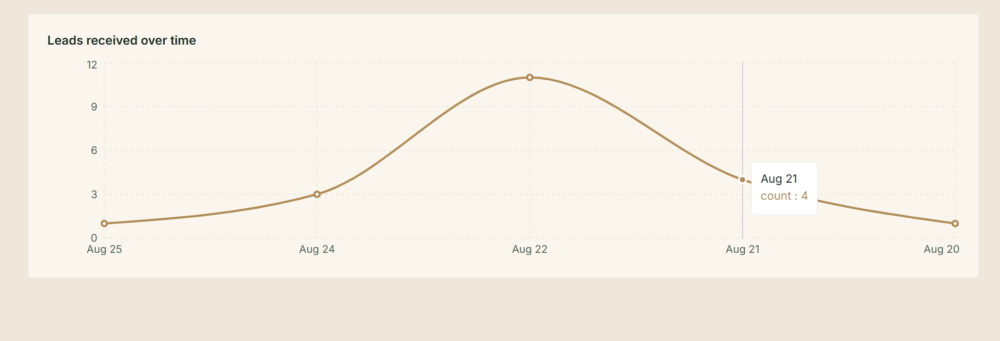
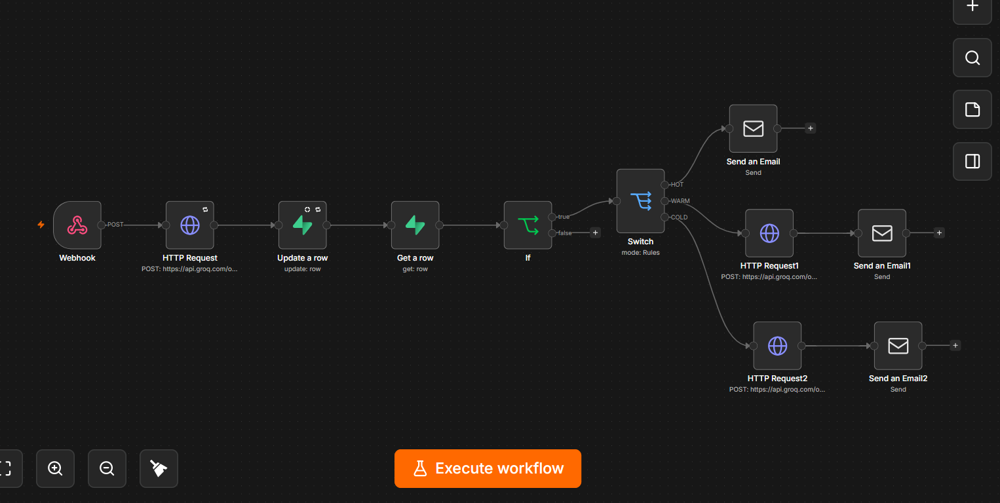
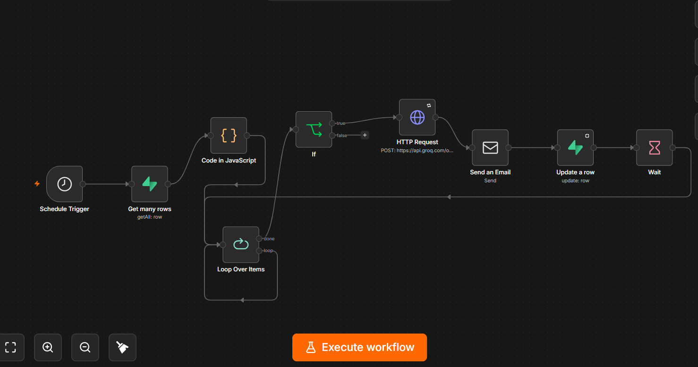
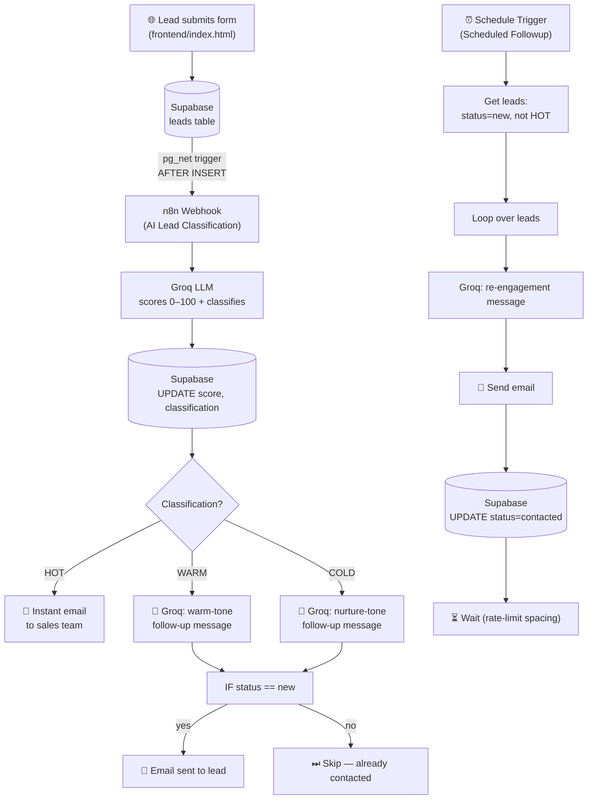

<div align="center">

# 🏡 PrimeNest Realty — AI Lead Qualification & Follow-Up System

**An end-to-end AI automation system that captures, scores, and nurtures real estate leads — with zero manual triage.**

*A fictional real estate business (Houston, TX) used as a portfolio case study for AI-powered lead automation.*

[](https://n8n.io/)
[](https://supabase.com/)
[](https://groq.com/)
[](https://vitejs.dev/)
[](https://vercel.com/)

[Live Dashboard](https://primenest-lead-system.vercel.app/) · [Watch Demo](#) · [Report Bug](../../issues)

</div>

---

## 💡 The Problem This Solves

Real estate agents lose deals not because leads don't come in — but because leads sit unanswered for hours while agents are showing houses. A hot lead that isn't contacted within 5 minutes is dramatically less likely to convert.

**PrimeNest Realty** simulates a real agency's inbound pipeline and automates the entire triage process: the moment a lead submits a form, an AI reads their message, scores their intent, classifies them as `HOT` / `WARM` / `COLD`, and either alerts a human salesperson instantly or sends a tailored, tone-matched follow-up — automatically, with no manual sorting.

---

## 🎥 Preview

<table>
<tr>
<td width="50%">

**Lead Capture Form**


</td>
<td width="50%">

**Leads Table (Filterable)**


</td>
</tr>
<tr>
<td width="50%">

**Analytics — Classification Breakdown**


</td>
<td width="50%">

**Analytics — Leads Over Time**


</td>
</tr>
<tr>
<td width="50%">

**n8n — AI Lead Classification Workflow**


</td>
<td width="50%">

**n8n — Scheduled Followup Workflow**


</td>
</tr>
</table>

---

## 🧠 How It Works



**In plain terms:** a lead fills out the form → Supabase saves it and *automatically* pings n8n (no polling, no manual trigger) → an LLM reads the message and scores buying intent → hot leads get a human on the phone fast, warm/cold leads get an AI-personalized email → a safety check stops duplicate emails → a scheduled job quietly re-engages anyone who's gone cold.

---

## ✨ Features

| # | Feature | What it does |
|---|---------|---------------|
| 1 | **Lead Capture** | Styled form → Supabase insert, with toast notifications for success/error |
| 2 | **Duplicate Detection** | Unique email constraint at the DB level with a friendly, non-technical error message |
| 3 | **AI Lead Qualification** | Webhook → Groq scores intent (0–100) and classifies HOT / WARM / COLD → writes back to Supabase |
| 4 | **Salesperson Alerts** | HOT leads trigger an instant internal email so no urgent lead sits idle |
| 5 | **Tone-Matched Follow-Ups** | A Switch node routes WARM vs. COLD leads to separate Groq prompts, each generating a different tone of outreach |
| 6 | **Zero-Polling Automation** | A Supabase `pg_net` trigger fires `net.http_post` on every insert — n8n is invoked instantly, no cron polling needed |
| 7 | **Analytics Dashboard** | React + Recharts: filterable leads table with inline status editing, plus score averages, %HOT, and bar/pie/line charts |
| 8 | **Authenticated Access** | Supabase Auth gates the dashboard; RLS locked from public to authenticated-only |
| 9 | **Duplicate-Send Protection** | Before sending any WARM/COLD email, n8n re-fetches the lead's *current* status and only proceeds if it's still `new` |
| 10 | **Scheduled Re-Engagement** | A separate workflow periodically finds cold/stale leads and sends a rate-limited, AI-written nudge to bring them back |

---

## 🛠 Tech Stack

| Layer | Technology |
|---|---|
| **Frontend (Lead Form)** | Vanilla HTML / CSS / JS — `frontend/index.html` |
| **Dashboard** | React + Vite — `dashboard/`, deployed on Vercel |
| **Database / Backend** | Supabase (PostgreSQL) |
| **Automation** | n8n (self-hosted, tunneled via ngrok for development) |
| **AI / LLM** | Groq API — `openai/gpt-oss-20b` |
| **Email Delivery** | Gmail SMTP via n8n's Send Email node |
| **Charts** | Recharts |

---

## 🗄 Database Schema

**Table: `leads`**

| Column | Description |
|---|---|
| `id`, `created_at` | Standard identifiers |
| `name`, `email`, `phone`, `message` | Captured from the lead form |
| `status` | `new` → `contacted` → `replied` → `won` / `lost` / `opted_out` |
| `score` | AI-generated intent score, 0–100 |
| `classification` | `HOT` (70–100) · `WARM` (40–69) · `COLD` (0–39) |
| `ai_summary` | Short LLM-generated summary of the lead's message |

---

## ⚙️ n8n Workflows

This repo includes two exported workflows in `frontend/workflows/`:

1. **`AI Lead Classification`** *(pictured above, left)* — the main pipeline: `Webhook → Groq → Update → Get Row → IF → Switch → 3× (Groq + Email)` branches for HOT / WARM / COLD.
2. **`Scheduled Followup`** *(pictured above, right)* — the re-engagement pipeline: `Schedule Trigger → Get Row (status=new, classification≠HOT) → Loop Over Items → Groq → Send Email → Update (status=contacted) → Wait`.


---

## 🚀 Getting Started

```bash
# 1. Clone the repo
git clone https://github.com/Komal-Sharafat-518/primenest-lead-system.git
cd primenest-lead-system

# 2. Set up the dashboard
cd dashboard
npm install
```

Create a `.env` file in `dashboard/` with:

```
VITE_SUPABASE_URL=your_supabase_project_url
VITE_SUPABASE_ANON_KEY=your_supabase_anon_key
```

```bash
npm run dev
```

**For the automation side:**
1. Import both workflow JSON files from `frontend/workflows/` into your n8n instance.
2. Add your Groq API key and Gmail SMTP credentials in n8n's credential manager.
3. Set up the Supabase `pg_net` trigger to `POST` to your n8n webhook's **Production URL** on `leads` `AFTER INSERT`.
4. Open the frontend form (`frontend/index.html`) and submit a test lead.

---

## 🌐 Deployment Status

| Component | Status |
|---|---|
| Dashboard | ✅ Deployed on Vercel (Root Directory: `dashboard`) |
| Environment Variables | `VITE_SUPABASE_URL`, `VITE_SUPABASE_ANON_KEY` set in Vercel |
| n8n | ⚠️ Running locally + ngrok — not yet on a production host (known limitation) |

---

## 🐛 Gotchas & Lessons Learned

- n8n workflows must be **saved (Ctrl+S)** for changes to take effect — the canvas can show unsaved edits as if they're live.
- Supabase's built-in node only supports "Equals" filters — there's no native "not equals," so a separate **Filter node** is needed for that logic.
- n8n expression fields need the **Expression** toggle explicitly selected — leaving it on "Fixed" silently breaks dynamic values, even if the text *looks* like an expression.
- Groq's free tier has a per-minute token limit — batch-processing many leads at once can hit rate limits. Use **Split in Batches** / **Wait** nodes when testing with real data volumes, not just a handful of test rows.
- ngrok's free tier URL can stay fairly stable across restarts in a single session, but this isn't guaranteed — always double-check that n8n's Webhook **Production URL** matches what's registered in the Supabase trigger.

---

## 🗺 Roadmap

- [ ] Move n8n from local + ngrok to a production-hosted instance
- [ ] Add SMS follow-up channel alongside email
- [ ] A/B test Groq prompt tone variants for WARM leads
- [ ] Add lead source tracking (which channel each lead came from)

---

## 👤 About

**Komal Sharafat**
*AI Automation Developer & Full-Stack Web Developer*

Built to demonstrate practical AI automation, workflow engineering, and full-stack development skills.

📧 [komalsharafat0@gmail.com](mailto:komalsharafat0@gmail.com) · 🔗 [LinkedIn](https://www.linkedin.com/in/komal-sharafat-93697538b/)

---

<div align="center">
<sub>This is a portfolio project using a fictional business. No real client data is used.</sub>
</div>
